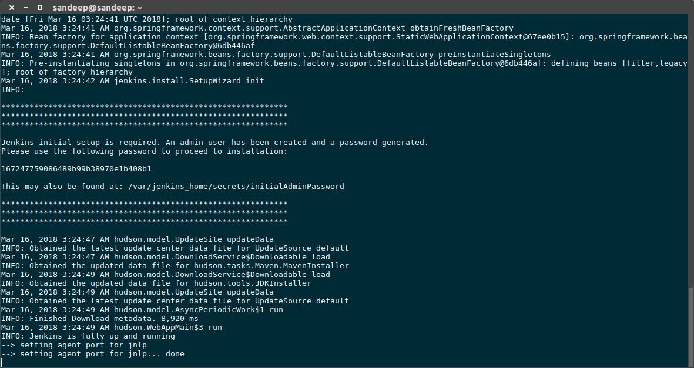
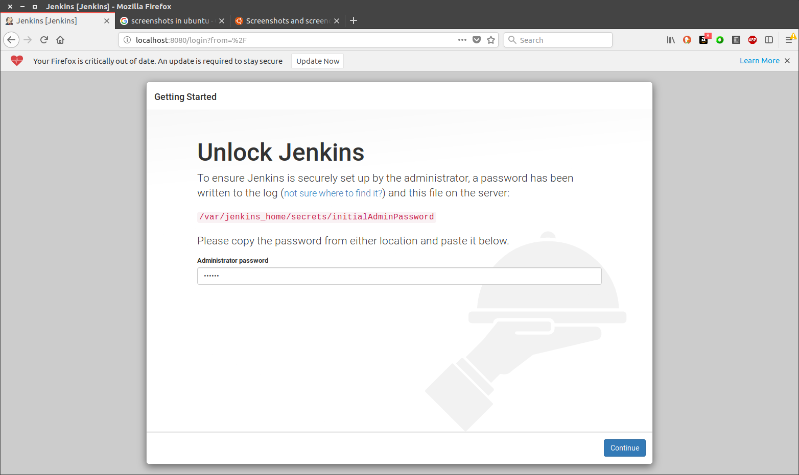
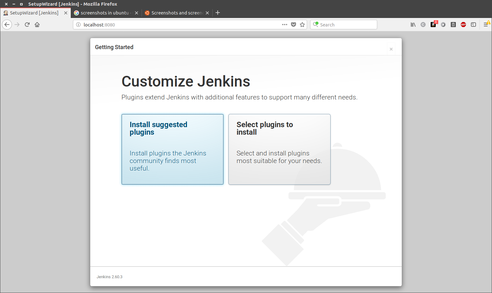
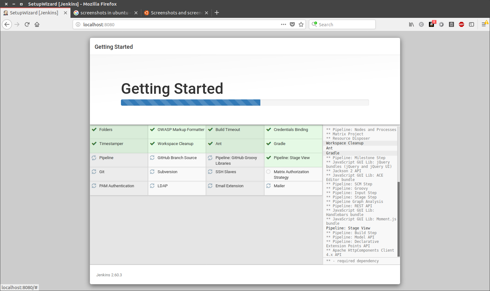
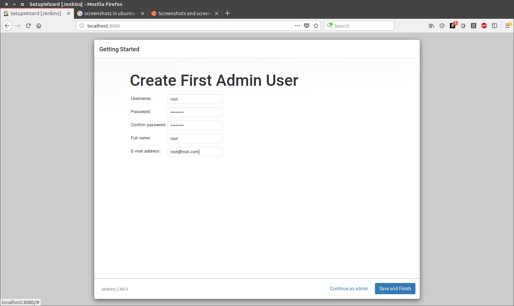
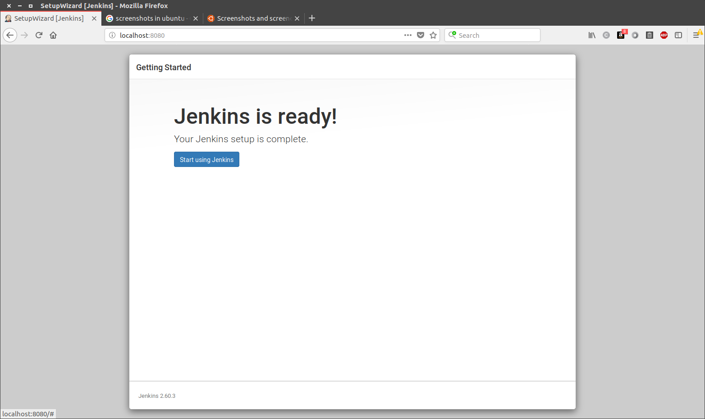
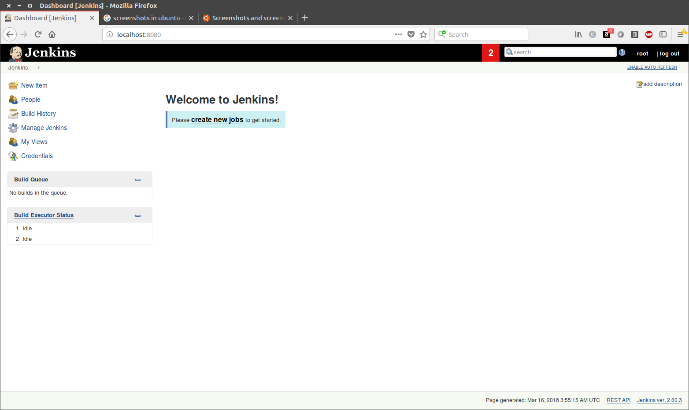

# Jenkins - Setup

## Install Jenkins

``` zsh
sudo docker pull jenkins
```

``` bash
sudo docker run -p 8080:8080 --name=jenkins-master jenkins
```

Once the jenkins container is running, we need to do a one time setup. As you can see in the terminal, copy the password printed or alternatively the password is always available at : 



``` /var/jenkins_home/secrets/initialAdminPassword```

For this, first login into the container by running the command,

``` sudo docker exec -i -t jenkins-master(name_of_the_image) /bin/bash```

Then navigate to the above path and copy the `initialAdminPassword` to the clipboard

• Now goto `http://localhost:8080/` to find the jenkins up and running as in Fig 1.2


Now Paste the `initialAdminPassword` in the clipboard in the jenkins webpage as in Fig 1.3

Click continue. Now jenkins gives options for a custom/suggested installation as in Fig 1.4. We select suggested installation.


This will install the standard components as in Fig 1.5



Once the installation is done, jenkins brings you to create first user. Create an user as shown in Fig 1.6



Once the user is created, click complete and jenkins in now ready to use! Fig 1.7


A fresh view of jenkins should look like Fig 1.8


